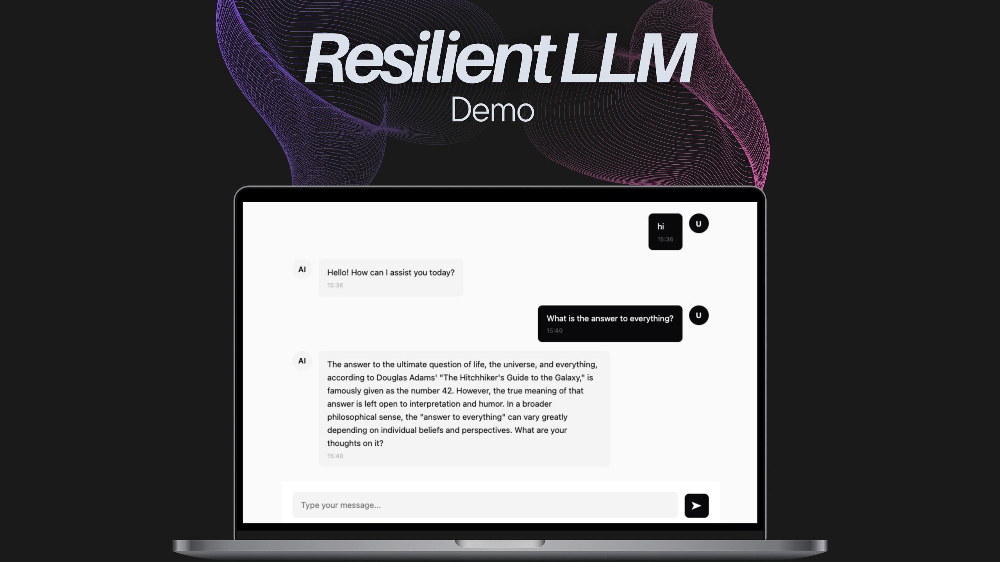

# Minimal AI Chat - made with Resilient LLM

A simple chat interface demonstrating [`ResilientLLM`](https://github.com/gitcommitshow/resilient-llm) usage



## Features

This project can act as a boilerplate or template to kickstart your AI chatbot project.

- Real-time chat with AI (feel free to change the LLM providers and models in `server/app.js`)
- Markdown rendering for assistant responses
- Minimal, clean UI design
- Lightweight and easy to extend because of the minimal dependencies. It is a vanilla html/js frontend serving AI response via a simple express API server.

## Project Structure

```
server/             --Backend files--
└── app.js          # Express server with ResilientLLM
client/             --Frontend files--
├── index.html      # Main HTML file (shows key integration functions)
├── styles.css      # Styling
├── api.js          # API integration with the express API backend
├── messages.js     # Message display and management
└── ui.js           # UI components and interactions
```

## Quick Start

### 1. Clone and Setup

```bash
git clone https://github.com/gitcommitshow/resilient-llm
cd resilient-llm/examples/chat-basic
```

### 2. Install Dependencies

```bash
npm install
```

### 3. Set Environment Variables

Set your API key and choose the default LLM service and model:

```bash
# OpenAI
export OPENAI_API_KEY=your_key_here
export AI_SERVICE=openai
export AI_MODEL=gpt-4o-mini

# Or Anthropic
export ANTHROPIC_API_KEY=your_key_here
export AI_SERVICE=anthropic
export AI_MODEL=claude-3-5-sonnet-20240620

# Or Gemini
export GEMINI_API_KEY=your_key_here
export AI_SERVICE=gemini
export AI_MODEL=gemini-2.0-flash
```

### 4. Start the Server

```bash
npm run dev
```

The server will start on `http://localhost:3000` and automatically serve the client files.

### 5. Open in Browser

Navigate to **`http://localhost:3000`** in your browser.

<details>
<summary><strong>Want to preview in the VSCode/Cursor editor directly?</strong></summary>

- Install [Live Preview extension](https://marketplace.cursorapi.com/items/?itemName=ms-vscode.live-server)
- Right-click on `client/index.html` → **"Show Preview"**

**Note:** The server must be running for the preview to work, as it serves the client files and handles API requests.

</details>

## How It Works

Uses `ResilientLLM` in `server/app.js` as following:

**1. Initialize ResilientLLM:**
```javascript
import { ResilientLLM } from 'resilient-llm';

const llm = new ResilientLLM({
    aiService: process.env.AI_SERVICE || 'openai',
    model: process.env.AI_MODEL || 'gpt-4o-mini',
    maxTokens: 2048,
    temperature: 0.7,
    rateLimitConfig: {
        requestsPerMinute: 60,
        llmTokensPerMinute: 90000
    },
    retries: 3,
    backoffFactor: 2
});
```

**2. Use it in your API endpoint:**
```javascript
app.post('/api/chat', async (req, res) => {
    const { conversationHistory } = req.body;
    const response = await llm.chat(conversationHistory);
    res.json({ response, success: true });
});`
```

**3. Send chat history from the frontend to get the AI response:**
```REST
POST /api/chat
Content-Type: application/json

{
  "conversationHistory": [
    { "role": "system", "content": "You are a helpful assistant." },
    { "role": "user", "content": "Hello!" },
    { "role": "assistant", "content": "Hi there!" },
    { "role": "user", "content": "What is JavaScript?" }
  ]
}
```

That's it! ResilientLLM returns the LLM response while automatically handling the rate limiting, retries, circuit breaking, and different types of errors thrown by LLM providers.

**Explore further:** Check `server/app.js` to see all configuration options and customize behavior via environment variables or direct code changes.

## Troubleshooting

- Make sure the server is running: `npm run dev`
- Ensure your API key is set in environment variables. When in doubt, pair the env with the server start command e.g. `OPENAI_API_KEY=your_api_key npm run dev`.
- Verify you're using the correct service name (openai, anthropic, or gemini)
- Ensure that you're using the correct model name
- Check that the API key is valid and has correct permissions

🐞 Discovered a bug? [Create an issue](https://github.com/gitcommitshow/resilient-llm/issues/new)

## License 

MIT License