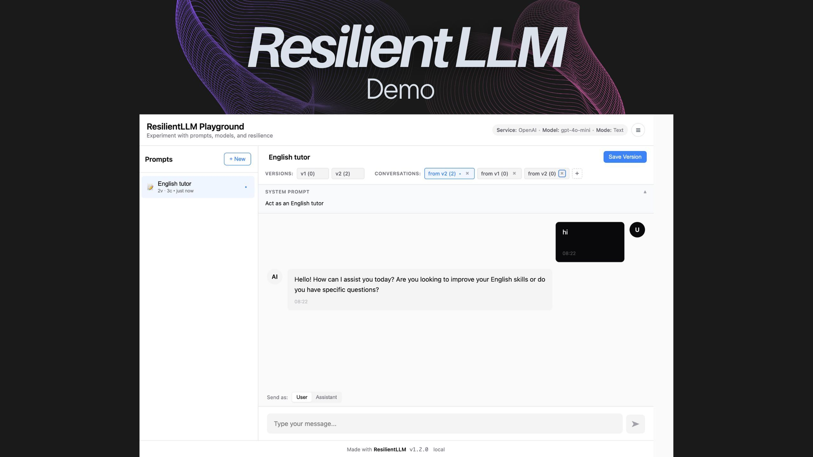

# AI Agent Playground - made with Resilient LLM

A simple playground to test and build with [`ResilientLLM`](https://github.com/gitcommitshow/resilient-llm)



## Features

This project can act as the starting point to test your prompt, workflow, and ResilientLLM behavior. Recommended to try this before starting your AI agent project.

- TK

## Project Structure

```
server/                    --Backend files--
├── app.js                 # Express server with ResilientLLM
└── devutility.js          # Development utilities
client/                    --Frontend files--
├── index.html             # Main HTML file
├── styles.css             # Styling
├── api.js                 # API integration with the express API backend
├── components/             # UI components
│   ├── ChatPanel.js
│   ├── MessageInput.js
│   ├── MessageRenderer.js
│   ├── Notification.js
│   ├── PromptHeader.js
│   ├── PromptsSidebar.js
│   ├── SettingsDrawer.js
│   ├── StatusBar.js
│   ├── SystemPromptPanel.js
│   └── VersionBar.js
├── core/                  # Core application logic
│   ├── App.js
│   ├── State.js
│   └── Storage.js
├── models/                # Data models
│   ├── Conversation.js
│   ├── Message.js
│   ├── Prompt.js
│   └── Version.js
└── utils/                 # Utility functions
    ├── datetime.js
    ├── dom.js
    └── markdown.js
```

## Quick Start

### 1. Clone and Setup

```bash
git clone https://github.com/gitcommitshow/resilient-llm
cd resilient-llm/examples/playground-js
```

### 2. Install Dependencies

```bash
npm install
```

### 3. Set Environment Variables

Set your API key and choose the default LLM service and model:

```bash
# OpenAI
export OPENAI_API_KEY=your_key_here
export AI_SERVICE=openai
export AI_MODEL=gpt-5-nano

# Or Anthropic
export ANTHROPIC_API_KEY=your_key_here
export AI_SERVICE=anthropic
export AI_MODEL=claude-3-5-sonnet-20240620

# Or Google
export GEMINI_API_KEY=your_key_here
export AI_SERVICE=google
export AI_MODEL=gemini-2.0-flash
```

### 4. Start the Server

```bash
npm run dev
```

The server will start on `http://localhost:3000` and automatically serve the client files.

### 5. Open in Browser

Navigate to **`http://localhost:3000`** in your browser.

<details>
<summary><strong>Want to preview in the VSCode/Cursor editor directly?</strong></summary>

- Install [Live Preview extension](https://marketplace.cursorapi.com/items/?itemName=ms-vscode.live-server)
- Right-click on `client/index.html` → **"Show Preview"**

**Note:** The server must be running for the preview to work, as it serves the client files and handles API requests.

</details>

----

🐞 Discovered a bug? [Create an issue](https://github.com/gitcommitshow/resilient-llm/issues/new)

## License 

MIT License